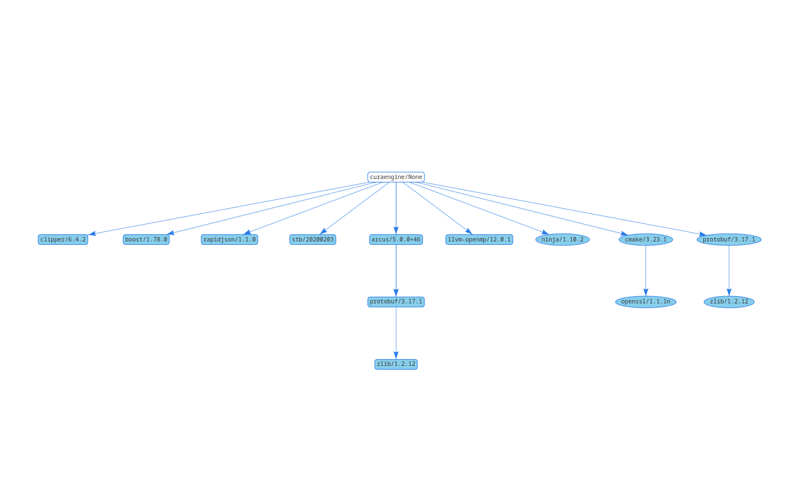

# CuraEngine

<p align="center">
    <a href="https://github.com/Ultimaker/CuraEngine/actions/workflows/unit-test.yml" alt="Unit Tests">
        </a>
    <a href="https://github.com/Ultimaker/CuraEngine/actions/workflows/conan-package.yml" alt="Unit Tests">
        </a>
    <a href="https://github.com/Ultimaker/CuraEngine/issues" alt="Open Issues">
        </a>
    <a href="https://github.com/Ultimaker/CuraEngine/issues?q=is%3Aissue+is%3Aclosed" alt="Closed Issues">
        </a>
    <a href="https://github.com/Ultimaker/CuraEngine/pulls" alt="Pull Requests">
        </a>
    <a href="https://github.com/Ultimaker/CuraEngine/graphs/contributors" alt="Contributors">
        </a>
    <a href="https://github.com/Ultimaker/CuraEngine" alt="Repo Size">
        </a>
    <a href="https://github.com/Ultimaker/CuraEngine/blob/master/LICENSE" alt="License">
        </a>
</p>

CuraEngine is a C++ console application for 3D printing GCode generation. It has been made as a better and faster
alternative to the old Skeinforge engine and is an integral part of [Cura](https://github.com/ultimaker/Cura). You can
use CuraEngine separately or in other applications. Feel free to add it to your application. But please take
note of the [License](LICENSE)

## License

  
CuraEngine is released under terms of the AGPLv3 License. Terms of the license can be found in the LICENSE file. Or at
http://www.gnu.org/licenses/agpl.html

> But in general it boils down to:  
> **You need to share the source of any CuraEngine modifications if you make an application with the CuraEngine. (Even if
> you make a web-based slicer, you still need to share the source!)**

## How to Install

Please check our [Wiki page](https://github.com/Ultimaker/CuraEngine/wiki/Building-CuraEngine-From-Source) for details on how to install CuraEngine.

### Dependencies



#### Runtime dependencies
- arcus
- boost
- clipper
- llvm-openmp
- protobuf
- rapidjson
- stb
- zlib

#### Build dependencies
- [Python](https://www.python.org/)
- [Cmake](https://cmake.org/)
- [Ninja (optional)](https://ninja-build.org/)
- [GNU-GCC](https://gcc.gnu.org/)
- [Visual Studio](https://visualstudio.microsoft.com/vs/)
- [xcode command line tools](https://developer.apple.com/xcode/)

#### IDE

If you're using [CLion](https://www.jetbrains.com/clion/) as an IDE be sure to checkout the Conan plugin
[Conan CLion plugin](https://docs.conan.io/en/latest/integrations/ide/clion.html)

## Running

Other than running CuraEngine from a frontend, such as Ultimaker/Cura, one can run CuraEngine from the command line.
For that one needs a settings JSON file, which can be found in the Ultimaker/Cura repository.

Run `CuraEngine help` for a general description of how to use the CuraEngine tool.

[Set the environment variable](https://help.ubuntu.com/community/EnvironmentVariables) CURA_ENGINE_SEARCH_PATH to the
appropriate paths, delimited by a colon e.g.

```
CURA_ENGINE_SEARCH_PATH=/path/to/Cura/resources/definitions:/user/defined/path
```

## Internals

> **TODO:** Add workings of BeadingStrategy, Extrusion- junction, line and segment

The Cura Engine is structured as mainly .h files. This is not standard for a C++ project. However, using less cpp files
makes the optimizer work harder and removes linking error issues. It's partially a result of lazyness but comes in handy
for optimizations.

The .h files contain different steps called from the main.cpp file. The main.cpp file contains the global slicing logic.

The slicing process follows the following global steps:

* Load 3D model
* Analize and fix 3D model
* Slice 3D model into 2D layers
* Build LayerParts from sliced layers
* Generate Insets
* Generate up/down skins areas
* Generate sparse infill areas
* Generate GCode for each layer

Each step has more logic in it. But this is a general overview.
All data for the engine is stored in the "SliceDataStorage". It's important to remember that only the data from the
previous step is valid.

Coordinates are stored in 64bit integers as microns in the code. So if you see a value of 1000 then this mean 1mm of
distance. This is because Clipper works on 64bit integers and microns give a high enough resolution without limiting the
size too much. Note that there are some bits and pieces of code that need to be careful about 64bit overflows,
especially calculating lengths sqrt(x*x+y*y) can cause overflows.

### OptimizedModel

The OptimizedModel is a 3D model stored with vertex<->face relations. This gives touching face relations which are used
later on to slice into layers faster.

### Slicer

While usually the whole GCode generation process is called 'slicing', the Slicer in the CuraEngine is the piece of code
that generates layers. Each layer contains closed 2D polygons.
These polygons are generated in a 2 step process. First all triangles are cut into lines per layer, for each layer a "
line segment" is added to that layer.
Next all these line-segments are connected to each other to make Polygons. The vertex<->face relations of the
OptimizedModel help to make this process fast, as there is a huge chance that 2 connecting faces also make 2 connecting
line-segments.
This code also patches up small holes in the 3D model, so your model doesn't need to be a perfect Manifold. It also
deals with incorrect normals, so it can flip around line-segments to fit end-to-end.
The slicing code is found in [slicer.cpp](src/slicer.cpp)

After the Slicer we have closed Polygons which can be used in Clipper.

### LayerParts

An important concept to grasp is the idea of LayerParts. LayerParts are seperate parts inside a single layer. For
example, in a solid cube each layer has a single LayerPart. However, in a table the layers which cover the legs have a
LayerPart per leg, and thus there will be 4 LayerParts.
A LayerPart is a seperated area inside a single layer which does not touch any other LayerParts. Most operations run on
LayerParts as it reduces the amount of data to be processed. During GCode generation handling each LayerPart as a
separate step makes sure you never travel between LayerParts which reduces the amount of external travel.
LayerParts are generated after the Slicer step.
The code for generating LayerParts is found in [layerParts.cpp](src/layerPart.cpp)

In order to generate the LayerParts, Clipper is used. A Clipper union with extended results gives a list of Polygons
with holes in them. Each polygon is a LayerPart, and the holes are added to this LayerPart.

### Insets

Insets are also called "Perimeters" or "Loops" sometimes. Generating the insets is only a small bit of code, as Clipper
does most of the heavy lifting.
The code for generating insets is found in [WallsComputation.cpp](src/WallsComputation.cpp).

### Up/Down skin

The skin code generates the fully filled areas, it does this with some heavy boolean Clipper action. The skin step uses
data from different layers to get the job done. Check the code for details.
The sparse infill area code is almost the same as the skin code. With the difference that it keeps the other areas and
uses different offsets.
The code for generating skin areas is found in [skin.cpp](src/skin.cpp).

Note that these steps generate the areas, not the actual infill lines. The infill line paths are generated later on. So
the result of this step are lists of Polygons which are the areas that need to be filled.

### GCode generation

The GCode generation is quite a large bit of code. As a lot is going on here. Important bits here are:

* PathOrderOptimizer: This piece of code needs to solve a TravelingSalesmanProblem. Given a list of polygons/lines it
  tries to find the best order in which to print them. It currently does this by finding the closest next polygon to
  print. The code for this is found in [pathOrderOptimizer.cpp](src/pathOrderOptimizer.cpp).
* Infill: This code generates a group of lines from an area. This is the code that generates the actual infill pattern.
  There is also a concentric infill function, which is currently not used. The code for this is found
  in [infill.cpp](src/infill.cpp) and the [infill subfolder](src/infill/).
* Comb: The combing code is the code that tries to avoid holes when moving the head around without printing. This code
  also detects when it fails. The final GCode generator uses the combing code while generating the final GCode. So they
  interact closely. The combing code is found in [pathPlanning/Comb.cpp](src/pathPlanning/Comb.cpp)
* GCodeExport: The GCode export is a 2 step process. First it collects all the paths for a layer that it needs to print,
  this includes all moves, prints, extrusion widths. And then it generates the final GCode. This is the only piece of
  code that has knowledge about GCode keywords and syntax to generate a different flavor of GCode it will be the only
  piece that needs adjustment. All volumatric calculations also happen here. The code for the GCode export is found
  at [FffGcodeWriter.cpp](src/FffGcodeWriter.cpp)
