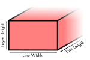

Exporting to G-code
====
At the end of the slicing process, CuraEngine will have created a complete plan with all the things the printer must do in order to produce the desired product. This plan is represented in CuraEngine's internal data structure and must now be translated into g-code. The translation happens in parallel to the planning stage as a separate thread, in order to save on memory usage.

Translation
----
There is a one-on-one mapping from CuraEngine's internal data structure to g-code, so the translation step is very easy:

* A path gets converted to a `G1` command, with the destination coordinates of the path in the parameters of the command.
* A travel move gets converted to a `G0` command, again with only the destination coordinates.
* A heating command gets converted to an `M104` or `M109` command, depending on whether the printer needs to wait on it.
* The bed temperature is changed using an `M140` or `M190` command, depending on whether the printer needs to wait on it.

And so on. CuraEngine implements several dozen different commands. CuraEngine only implements g-code though, so if the output needs to be in a different format such as X3G, Cura's front-end will arrange the translation from g-code to the final format.

Changing State
----
Paths have several properties in the internal representation. Each path has a line width, velocity, fan speed, acceleration, jerk, layer thickness and flow. If any of those properties (except line width and layer thickness) changes, the command must be altered or some other command must precede it.

* If the velocity changes, the command must include the `F` parameter to set it to the correct speed.
* If the acceleration changes, the command must be preceded by an `M204` command to set the correct acceleration.
* If the jerk changes, the command must be preceded by an `M207` command to set the correct jerk.
* If the fan speed changes, the command must be preceded by an `M106` command to dial the fan speed.
* If the filament must retract for this (travel) path, it will be preceded by a separate command to retract. For some g-code flavours this will be done using the `G10` command. For others this will be done with a `G1` command that sets the `E` parameter to something lower than it was before.

The E parameter
----
Each extrusion `G1` command contains an `E` parameter. This parameter indicates how much material should be extruded while making the move.

The amount of material CuraEngine commands the nozzle to extrude is equal to the volume of a box with the same length, width and depth as the line. The length of the line multiplied by the width of the line multiplied by the layer height will be the volume of the line. Multiply that with the desired material flow ratio and add that to the `E` parameter of the previous command to obtain the `E` parameter of this command. Though in some g-code flavours, this volume must then also be divided by the cross-sectional area of the filament in order to obtain the distance that the feeder motor must cover.

Some firmware cannot cope with E values that are very high in long prints. Every time the `E` parameter exceeds 10.000, the coordinate is reset using the `G92` command.