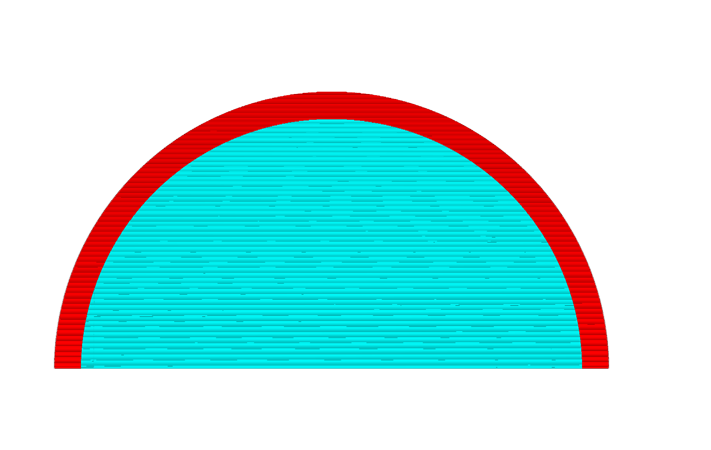

Generating Areas
====
After CuraEngine has created cross sections of your model, it will subdivide each layer into zones that it designates to be filled with material to serve a certain purpose. The most significant of these "features" are infill, skin, walls and support. The input of this slicing stage is a set of layers, and the output is a bunch of polygons for each of those layers. Those polygons are grouped by feature: Whether they must be filled with infill, skin, etc.

Separating Out the Walls
----
The first step in separating a layer into areas is to separate out the parts that are going to become walls.

To this end, a number of insets are produced from the original layer shape, one for each wall. In the image below, three walls are generated. One is for the outer wall (coloured in red), and the other two for the inner walls (in green).

The first inset (drawn in red) is generated for the outer wall. It's offset with 1/2 the line width of the outer wall. The result is a contour that goes through the middle of the outer wall. The corners of this contour will eventually end up in the g-code as the destination coordinates that the nozzle must move towards.

The second inset (in green) is generated for the first inner wall. It is an inset from the shape outlined by the first inset. This inset's distance is equal to half of the outer wall line width plus half of the inner wall line width. The half of the outer wall line width is to end up on the inside edge of the outer wall line, and then another half of the inner wall line width is added to end up again in the centre line of this first inner wall.

The third inset and any further insets are generated for the second inner wall and beyond. This is an inset of one inner wall line width away from the previous inset. The shape is then again the centre line of the next inner wall.

Lastly, one additional inset is produced from the innermost wall, by half of the inner wall line width (drawn in black). This inset marks the inside edge of the walls. That shape then has to be filled with either skin or infill.

Separating Skin from Infill
----
CuraEngine then needs to fill this middle inset with skin and infill. It needs to determine where to place skin and where to place infill.

The basic technique to find areas that need to be filled with bottom skin (for instance) is to look several layers below you, depending on the thickness of the skin. Wherever there's air in the lower layer, there must be skin in the current layer.

 

In the images above, the layer that it's subdividing into skin and infill is shown in red. It's looking at the blue layer to determine what part of this area is going to become skin and what is going to become infill. The parts that are inside the red area but not the blue area will become skin. The parts that are in both the red and the blue areas will become infill.

Reality is slightly more complex though: CuraEngine must look not only at the layer that is one skin thickness below the current layer, but also all layers in between. Otherwise a gap in the layers that is smaller than the skin thickness will not be picked up.

For the top skin, CuraEngine must look to the layers above the current layer, instead of at layers below it.

Support
----
Generating support is a fairly complex algorithm, but the gist of the idea is outlaid here.

The first step in generating support is determining where there is overhang in your print. The surfaces of the 3D mesh are not retained in memory at this point any more, so we can't just look at the triangles that have a certain angle w.r.t. the Z axis; we must look only at 2D layers.

A normal, filled layer is assumed to support the layer that's above it. It will also support the layer above it fine even if the layer above it extends slightly beyond the layer below. The limit to how far the layer above can extend to still be supported by the layer below is what we'll call the "support distance". If we assume that the layer below supports the layer above if the slope between the edges of these layers is less than a certain angle (the Overhang Angle setting), then we can compute the support distance with a simple formula: `tan(a) * layer_height`

CuraEngine will perform an offset of the current layer (drawn below in black) by this support distance (drawn in gray), and then subtract that from the layer above to get the area that is called the "basic support" (drawn in blue).

This type of support wouldn't print well however. It is all broken up into pieces. Typically this generates long, thin strands of areas (about 0.2mm wide) that need to be supported but gaps in between because technically that part in between is supported by the previous layer.

To get a more continuous support area, the basic support areas are merged. This merge is done by performing an offset of the support area by the support distance. Since the basic support areas tend to have the support distance between them, this causes adjacent support areas to overlap and merge together.

This does extend the support beyond the original part that needs to be supported, so it then subtracts everything from the support that is not in the layer above. This is called the "extended support" and forms the basis for the area that will eventually be filled with the support pattern. It needs some slight modifications though.

Support X/Y and Z Distance
----
The extended support would produce support that looks a bit like this:

This looks nice but is undesirable since the support is directly adjacent to the mesh. It would stick far too well to the mesh. For that reason, some distance is created between the support and the model. Cura has several settings concerning the distance in the Z direction and in the X and Y directions.

The Z distance is maintained by not looking directly at the part that needs to be supported in the layer above the current layer, but by looking several layers higher, of which the total thickness equals the Z distance. This would then create a print like this:

If the slope is very steep or there is a bit of overhang next to a vertical wall, this would still cause problems since the support is still very close to the sides of the print. This can be seen in the image above at the bottom side of the print. For this reason, CuraEngine also maintains a horizontal distance, the Support X/Y Distance setting.

This introduces two constraints in the distance that support must keep to the model however: It must maintain a certain Z distance and a certain X/Y distance. Neither of these may be too small or too large. This is overconstrained, so one of them must supersede the other. This is determined by the Support Distance Priority setting, which can be set to prioritise either the Z distance or the X/Y distance. By default, the Z distance is prioritised. This causes our print to look a bit like this:

As you can see, the X/Y distance is only applied if the Z distance is not applicable: In the small area at the bottom where the slope was completely vertical. This does catch many cases with mechanical parts though where a vertical wall is next to a piece of overhang.

In many cases with more organic shapes this is still not desirable however, since the support will still stick to a slope that is _almost_ vertical. For these cases there is another setting, Minimum Support X/Y Distance, which overrides the Z distance again. The print will then look like this:

In the picture above there is a slight kink in the curve along the topside of the support if you look closely. Above the kink the Z distance is leading. Below the kink the Minimum Support X/Y Distance is leading.

Stair-Stepping
----
In order to be able to easily remove support from sloped surfaces, stair-stepping was added.

If support has to be generated above a sloped surface, stair-stepping is invoked with the Support Stair Step Height and the Support Stair Step Maximum Width a step can have as parameters. The idea is to start at a layer, and for the next few layers above it (determined by the step-height and layer-height) 'lock' the layers in to place in the specific area of the slope. After that (when the step-height is reached), 'release' the next layer and take that as the next base.

In practice, this will create an inverted staircase, where the tips of the steps are closest to the model and likely the only contact-points.

This picture shows clearly what stair-stepping is meant to do. For clarity, all support-offset distances have been set to 0.

There are some subtleties to the stair-stepping algorithm however, when it comes to the X/Y-distance offset and Z-distance offset: Namely, _if_ support is higher above the sloped area because of X/Y-distance, then the additional height above the model _isn't_ taken into account when the 'steps' are produced. 

As you can see in the picture above, in this case (Z-distance set to 0, X/Y distance increased, but lower than the step-height) it's as if the stair-stepping was done _first_, and only afterwards the X/Y distance was subtracted (that's not _quite_ how it works internally, but the effect here is the same).

However, _if_ support is higher above the sloped area because of the Z-distance, then the additional height above the model _is_ taken into account when the steps are created.

In the picture above you can see that effect in that case (Z-distance increased, X/Y-distance set to 0). Notice how the support is raised above the model, but the height of the stair-steps aren't influenced.

Of course, in practice, X/Y- and Z- distance offsets are both often greater than none. In that case it depends on the slope of the model, whether X/Y overrides Z or the other way around, and on the particular distances involved.

