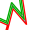

Generating Paths
====
One of the stages of slicing is to fill the areas, that were previously designated to a certain feature type, with lines that build the actual object. This stage could be considered the most complex. It's where CuraEngine uses most of its tricks. The devil is in the details. This page will highlight some of the major techniques involved.

Printing Order
----
The paths are generated in the same order in which they will be printed. This saves on memory and makes the architecture simpler. Therefore, before generating the paths the order must be determined. The order in which to print things is fairly rigid.

There is a precedence order for which things are considered more important to group together. This precedence goes as follows.

1. Each mesh group is printed in the sequence that they are sent to CuraEngine. A mesh group is a group of meshes that will get printed from bottom to top. Normally, your entire scene will consist of one mesh group, but if slicing via the command line or if the "One at a Time" mode is enabled in the front-end, you could have multiple mesh groups. The optimal sequence is determined by the front-end in order to minimise the collision area of each mesh group due to the shape of the print head when the nozzle needs to move back down towards the build plate for each mesh group.
2. The layers are printed in sequence from bottom to top.
3. Every extruder plan is printed in a certain order. The optimal order in which to print the extruders is determined beforehand in order to minimise the number of extruder switches. For example, if the printer has two extruders, then the first layer might start with the first extruder, then switch to the second extruder. The next layer must then start with the second extruder (so that there is no switch upon the layer transition) and switch to the first extruder. There will then be at most one extruder switch per layer.
4. Every mesh is printed separately. The order is determined in order to minimise travel moves and switches in configuration.
5. Every part of a mesh is printed separately. The order is determined in order to minimise travel moves again. The "parts" of a mesh are the disparate zones that originally came from the same 3D model file, but are in this layer separated by air.

Within a plan for an extruder on a layer, there is also a rigid order in which the features are printed. This order is as follows.

- Prime blob, if this is the first layer and a prime blob is requested.
- Prime tower, if the prime tower is enabled and there are any extruder switches in this layer or any higher layer.
- The skirt, brim or raft, whichever one is activated, if any, and if the bed adhesion is printing with this extruder.
- Ooze shield, if enabled and this is the first extruder on the layer.
- Draft shield, if enabled and this is the first extruder on the layer.
- Support, if enabled and set to print with this extruder.
- Each part is printed in order.
  - Infill.
  - Inner Walls.
  - Outer Wall.
  - Gaps in the walls are filled.
  - Skin.
  - Gaps in the skin are filled.
  - Ironing, if enabled.
  - Surface Mode, if set to "All" or "Surface".

Within a part there is a slight flexibility in the order due to the "Infill Before Walls" setting and the "Outer Before Inner Walls" setting.

Generating Walls
----
During the stage where the areas are generated for each feature type, one inset was already generated for every wall. These insets are going to become the centreline for each wall. Their vertex coordinates are eventually going to end up in the g-code as the destination coordinates of moves. Some work needs to be done to plan them properly though.

Each wall is given a certain line width, depending on the line width settings. The line segments for these walls are stored in an "Extruder Plan", an internal data structure. However the area that will get covered by these walls must also be calculated. In particular, the area that is _not_ covered by the walls must be calculated, because these are gaps that fall between the walls and must be filled with material later. In the image below, these gaps are indicated with a black outline.

Typically such gaps occur in very sharp corners. The nozzle is too fat to fit all the way into the corner without overextruding, so a gap will fall in the thinner part of the corner. Gaps can also occur in thin pieces where two walls are too close to each other to fill with another wall.

When generating a wall, CuraEngine also checks for overlap with previously printed walls. This includes the wall right before it, where there could be considerable overlap. The part of the new wall that overlaps with the previous wall will get its line width reduced such that the new area of that part of the line is only the part that is not covered by the other line.

Instead of actually reducing the flow rate of this thinner line segment, the speed of movement is increased. Typically a printer will have more short-term control over its velocity than its flow rate.

Infill Patterns
----
Infill patterns are used not only for generating infill, but also for generating support, skin and even ironing. They are CuraEngine's go-to method to fill an area with material. Here the task is to draw lines inside a certain shape to fill that shape with the desired material density.

The most basic infill pattern is lines infill. Most infill patterns are based on lines. Triangular infill, for instance, is just lines infill but repeated three times at 60 degree angles from each other. Even octet infill is based on lines, repeated twice vertically and twice horizontally, and then shifted with a certain offset as to create tetrahedra and octets.

For lines infill, the shape to fill is crossed with several scan lines at a certain distance from each other. This distance is computed such that the line width of this feature causes the desired infill density (e.g. 1 line width distance for 100% density, twice the line width for 50% density, and so on). Where the scan lines intersect the shape, the intersection point is computed and between every two scan lines, a line is generated. This is line infill.

Infill lines are optionally connected together. The algorithm to connect infill lines starts connecting two arbitrary adjacent lines. Then it follows the perimeter until it encounters the next crossing and connects that to the crossing after it, and so on until it's passed around the entire perimeter. It skips only the adjacent crossings if they are already part of the same polyline, so that no loops are created. This usually creates one single infill polyline, but this is not guaranteed; there are exceptional shapes that cannot be completely connected in this way.

Filling Small Gaps
----
Sometimes there is a gap between two walls or a bit of skin that is just too small to fill with a full-fledged wall or skin line. These gaps are filled with a special technique that aims to be able to fill any arbitrarily shaped gap with material. The areas that need to be filled with gaps are generated when the lines for walls and for skin are generated, by subtracting the area that gets covered by walls and skin lines from the area that was originally designated for walls and skin respectively.

The first step in this process is to fill a shape with very thin lines. These thin lines are planned normally. The image below shows a theoretical gap that fell between two walls that approached each other in a curve, and at this point was too thin to fit another wall between them.

This wouldn't print well. For one, these lines are barely thick enough to extrude any material at all. The accelerations that the printer would be subjected to by these lines would also kill any resemblance of print quality. Therefore these lines are connected to each other in a smoother curve. If the endpoints of two adjacent lines are close enough together, they will get merged together. When this happens, a line will get drawn from the middle of the first line segment to the middle of the second line segment. The result would be something like the image below.

The line widths of these lines are then adjusted in order to cover the same area as the original skin lines that they replaced. Just like when the line widths of walls were adjusted to compensate for overlapping walls, CuraEngine adjusts the print speed here too instead of actually extruding less or more while printing these lines. The printer typically has greater control over movement speed than over the flow of material exiting the nozzle. The result of adjusting these line widths looks a bit like the image below.

The area covered by this adjusted line approximates the total area of the gap, since it equals the area covered by the original thin lines.

Optimal Line Order
----
When a bunch of lines are printed together, the optimal order in which to print these lines is approximated. This is not used for all lines together, but only for a group of lines of the same feature and the same part, such as the skin lines within one part. Finding the perfect order is a special case of the [Travelling Salesman Problem](https://en.wikipedia.org/wiki/Travelling_salesman_problem) which is an NP-hard problem for which only exponential-time algorithms exist, which is infeasible to compute for CuraEngine within a desirable time span. The Nearest Neighbour approximation heuristic is made, which is only quadratic.

For this approximation, after printing a line, CuraEngine looks for the nearest endpoint of a line that has not yet been printed. It travels there and prints that line. Then the nearest unprinted line is chosen again, and so on until all lines have been printed.

One slight adjustment needs to be made though because the nozzle cannot accelerate perfectly. Travel moves that move in a line parallel to the line that has just been printed are preferred. There is a weighting scheme to make this consideration based on the sine of the angle between the printed line and the line towards the destination. This reduces overal printing time due to acceleration limitations.

Travelling
----
When moving from A to B, CuraEngine needs to be careful not to make the fragile surface of your print ugly by hitting it with a hot, plastic-covered nozzle in the wrong spots. It employs a couple of techniques to minimise this.

If a retraction is requested while the nozzle happens to be located on a wall, it needs to move inside the mesh a bit further first. Retracting causes the nozzle to pause for a while. During this time it is oozing material and melting any previously printed material it's touching. Inside the model this is less of an issue since it's not visible. The nozzle will move inside, retract there, then move to the infill of its destination part. Similarly, in the destination part it may also not directly go to its destination location if this lies too close to the outside of the print. It must travel to the inside of the mesh first, away from the walls, unretract there and then move to its final destination.

The travel from one part to another will ooze some material even if the material is retracted. That's why CuraEngine will first find the place where the two parts are closest together and make the crossing there instead of at the place where it started. This technique is called combing. It minimises the amount of material that ends up as a blip on the outside of your print. The total travel time is longer, but the travel time outside of the model is shorter. The image below sketches an example of how such a travel would look.

With any travel move CuraEngine needs to be careful not to cross any outside walls unnecessarily. It could avoid hitting these walls with a Z-hop, but the Z axis is typically slow and susceptible to wear. It could also move around these walls horizontally with collision avoidance. Making a choice between when to retract, perform combing and perform a Z hop is a complex affair that roughly follows the following flow chart:

Collision avoidance is performed by offsetting everything that the nozzle might hit with a certain safe distance, and then seeing if the travel move intersects this offset. If it does, the intersection points are determined and the decision must be made as to which direction to go in order to avoid this object. The decision of which direction to go is heuristically determined based on the amount of vertices along the perimeter of the shape that needs to be avoided. The side with the fewest vertices is assumed to be the shortest detour, so the travel move is adjusted to follow the perimeter of the offset along that side. If any vertices can be skipped without hitting another perimeter, these vertices are left out. The result looks like the image below.

This same technique for collision avoidance is employed when travelling within a single piece. An inset of this piece is then performed and the perimeter of that is avoided. If the travel move can be made within one piece, a retraction may not be necessary.
