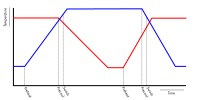
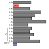

Inserts
====
After all paths have been generated, one extra pass is made over these paths. This pass may insert things in the printing plan. Currently the only commands inserted are pre-heating and pre-cooling commands.

Pre-heating and Pre-cooling
----
When printing with multiple extruders, the printer should cool down the nozzles that are on stand-by while another nozzle is printing. This prevents the material from degrading due to the heat, which would cause clogging. The nozzle is cooled down to the stand-by temperature. Before the nozzle can be used again, it must be heated back up to printing temperature. This is what the pre-heating procedure is for.

Also, shortly before switching extruders, the active extruder is cooled down slightly. This causes the nozzle to have a somewhat lower temperature during the switching of extruders, which reduces the amount of oozing during this switch. The temperature regulation of CuraEngine for two nozzles then ends up looking something like the image below.

There is a machine setting that tells Cura how fast a nozzle can heat up, approximately, in degrees Celsius per second. This is of course a rough approximation since the heating speed varies strongly with the delta between the nozzle temperature and the environment temperature. But it works well enough to estimate the amount of time required to bring the nozzle from stand-by temperature to printing temperature. This pre-heating time is how far before the first extrusion of that nozzle the printer must start heating up.

Inserting Commands
----
When it is known how far ahead the nozzle must start heating up, the engine must calculate for each command in the plan how long that command takes to execute. That way it knows where in the plan the heating command must be placed.

The time estimates are calculated precisely here, taking everything into account that CuraEngine knows about: velocities, accelerations, jerk, retractions, waiting for minimum layer time, everything. It is not strictly necessary to compute this for every line in the plan. However the total time estimate must be made for the whole print anyway and put in the g-code header, so it is efficient to compute that at the same time.

Once it is known for every line how long it takes to print, CuraEngine will simply add up the printing times for these lines until they exceed the pre-heating time. Then the same is done for the pre-cooling commands.

