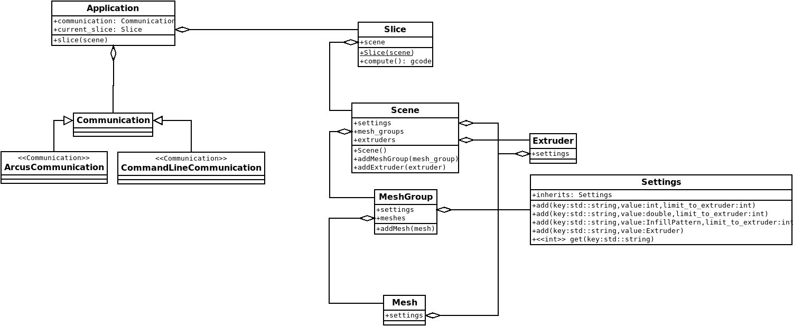

Scene
=====
This document details the hierarchical structure in which objects are organised in the scene that needs to be printed. This structure looks like the diagram below.

The Hierarchy
-------------
A number of slices can be queued up to be processed. Each slice contains their own scene, which represents the build plate full of objects that are supposed to be printed.

Each scene contains a number of mesh groups as well as a number of extruders. These mesh groups are processed one at a time. For each of the mesh groups the same set of extruders are used. A mesh group contains a number of meshes.

This scene is built by the communication class (whichever one is active).