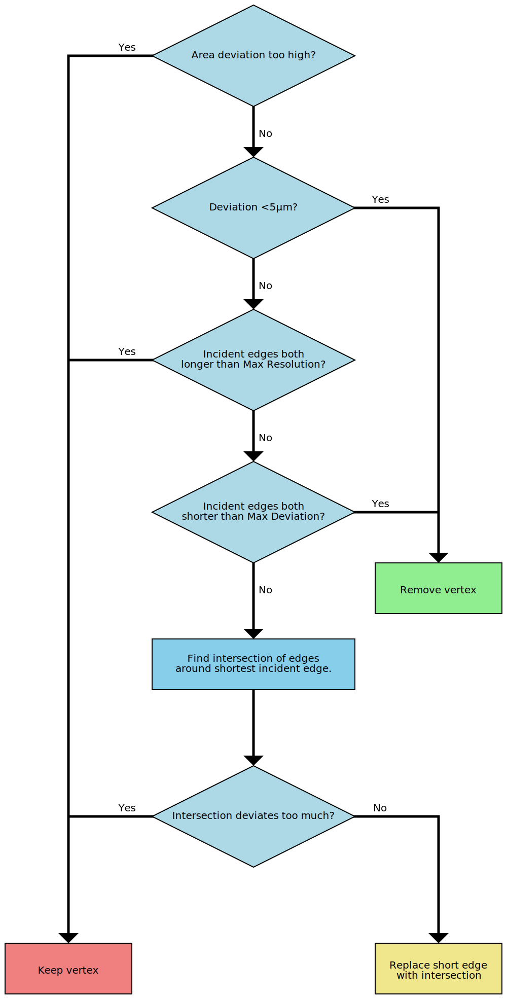
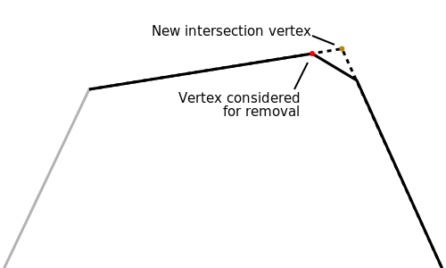

Polygon Simplification
====
CuraEngine will reduce the resolution of the input shapes. This is necessary for several reasons:
* The output g-code should not be too high resolution. If the g-code contains too many short moves, the processor in the 3D printer is not able to keep up with processing these commands in time. The nozzle moves too fast through these short commands, while the processing time remains equal for every move. As such, there are parameters to tune the resolution in Cura to make them work with the printer.
* This simplification removes degenerate cases, such as zero-length line segments or collinear line segments. This makes the algorithms in CuraEngine more efficient and less error-prone.
* Reducing the resolution of the layers makes CuraEngine slice faster.

The method of simplification is described here.

Base Algorithm
----
The simplification algorithm is based on [Visvalingam-Whyatt](https://en.wikipedia.org/wiki/Visvalingam%E2%80%93Whyatt_algorithm). It works as follows.

Each vertex in a polygon or polyline is assigned an "importance" rating, indicating how important that vertex is to the overall shape of the polygon or polyline. The importance rating used in CuraEngine is the deviation: How far would the polygonal chain move if the vertex were to be deleted. In other words, how far is the vertex from the line connecting the two adjacent vertices. This is different from the importance rating of the real Visvalingam-Whyatt algorithm.

In order of low importance to high importance, each vertex is considered for removal. This consideration works according to the following flow chart.

Replacing edges with intersections
----
If a vertex has a short edge on one side (that we'd like to remove) but a long edge on the other side (that we wouldn't like to shift, which would cause banding) then it tries to replace that edge with an intersection. It finds the two edges that surround the short edge, and calculates the intersection point between them. Instead of that edge, it then extends the two surrounding edges until the intersection point. This changes three edges into two, effectively removing the short edge and reducing the number of vertices by one.

