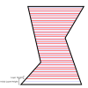

Slicing
====
This document explains how CuraEngine creates slices (cross sections) of a 3D mesh.

"Slicing" is a confusing term since Cura is considered a "slicer" and it calls the process of transforming a 3D mesh into g-code the "slicing" process. This document is about a more technically correct definition of "slicing": The process of creating cross sections of a 3D mesh at certain heights.

Determining layer heights
----
Before creating cross sections of a 3D mesh, CuraEngine must first determine at what heights to create these cross sections.

Each layer is considered to have a certain span across the Z axis. For example, the first layer will have a span of 0 to 0.27mm, the second layer from 0.27mm to 0.37mm, the third layer from 0.37mm to 0.47mm, etc. The cross section of each layer will be taken through the _middle_ of each layer's span, by default. For the initial layer in this example, it would slice at a height of 0.135mm. The layer will printed from the height of the _top_ of the layer though. It would put a command to move to `Z0.27` before printing that layer.

Normally, the first layer has a separate layer height, the Initial Layer Height. The rest of the layers use the normal Layer Height setting.

