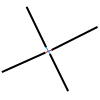

Slicing
====
This document explains how CuraEngine creates slices (cross sections) of a 3D mesh.

"Slicing" is a confusing term since Cura is considered a "slicer" and it calls the process of transforming a 3D mesh into g-code the "slicing" process. This document is about a more technically correct definition of "slicing": The process of creating cross sections of a 3D mesh at certain heights.

Determining layer heights
----
Before creating cross sections of a 3D mesh, CuraEngine must first determine at what heights to create these cross sections.

Each layer is considered to have a certain span across the Z axis. For example, the first layer will have a span of 0 to 0.27mm, the second layer from 0.27mm to 0.37mm, the third layer from 0.37mm to 0.47mm, etc. The cross section of each layer will be taken through the _middle_ of each layer's span, by default. For the initial layer in this example, it would slice at a height of 0.135mm. The layer will printed from the height of the _top_ of the layer though. It would put a command to move to `Z0.27` before printing that layer.

Normally, the first layer has a separate layer height, the Initial Layer Height. The rest of the layers use the normal Layer Height setting.

Alternatively, with Adaptive Layer Heights, the Z coordinates of the cross sections is determined based on the shape of the model. If Slicing Tolerance is set to Inclusive or Exclusive it will slice on the borders of layers instead of the middle.

Triangles to Lines
----
When the height of the cross section is determined, all triangles are intersected with the planes at every layer height, producing lines where they intersect.

For performance reasons, we figure out the "z bounding box" of each face at first which endows us with a fast precheck (layer height vs face). Then we parallize over the layer heights and perform the layer height vs face intersection test (including the precheck).

To find the intersection of a plane and a triangle, we simply interpolate all three line segments of the triangle. At least two of these interpolations should span the plane. We take the two coordinates where the interpolations have the same Z coordinate as the plane and those will become the two endpoints of the line segment.

Stitching
----
When all triangles have been converted to line segments, every layer contains a bunch of loose line segments. These line segments are not yet connected to form polygons.

In order to connect them CuraEngine looks at the line segments with endpoints that are close together. Lines have a direction though, and that direction must be consistent in order to produce a good polygon.

Nonmanifold Meshes
----
Not all meshes are perfect. Many meshes that Cura has to slice will not be watertight or have extra geometry in the middle. There are two important routines that are applied in the slicing stage to help for such meshes.

When the surface of a mesh intersects itself, quite often there will be a case where one coordinate has more than two line segments adjacent to it. In such a case CuraEngine will try to link the surfaces together that are most parallel to each other. This usually makes sense as we like to see meshes that are continuous, rather than having crossings where the walls both make a sharp turn.

If a chain of line segments can't be connected to form a closed loop, this chain is stored as an open polygon. Open polygons are not used for CuraEngine's normal slicing process, but are stored for later if Surface Mode is set to "Surface" or "Both". In that case, they are converted into wall paths during the path generation stage. In the example below, there is a line segment in the middle that is not connected to anything. It won't be part of a polygon during most of the slicing process. 

In this example, there is also a chain of line segments that ends on one side into itself, and has a loose ending on the other side too. This will also be considered an open polygon. Note also that the T-crossing will connect the two lines that are most parallel to each other. The third endpoint will be open-ended.